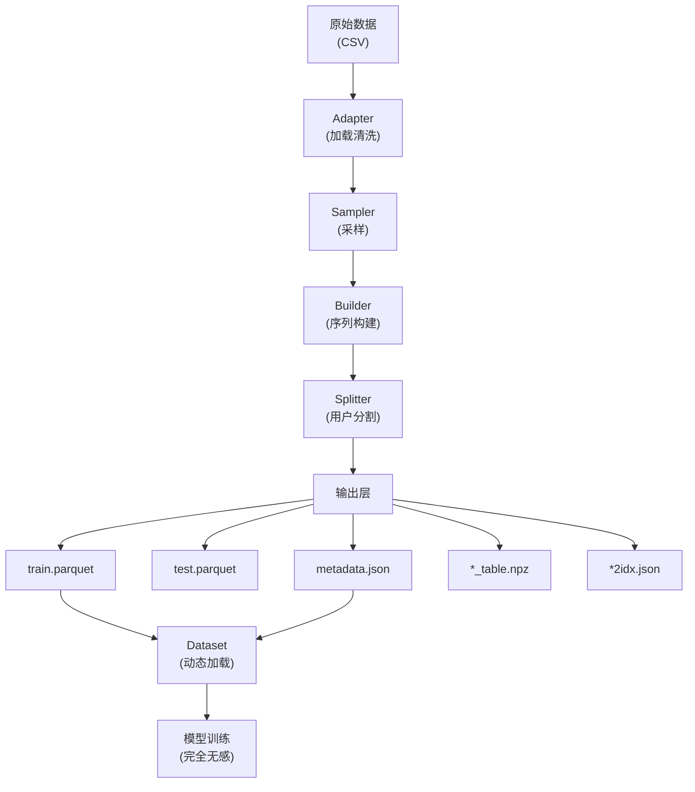

# 数据流水线 V2 升级记录 (V1 -> V2 Migration)

> **日期**: 2026-02-26
> **影响范围**: [🔴 BREAKING] (核心数据格式与元数据重构)

本重构引入了"一库、两表、三图"的统一数据中枢架构，用以替代原有散乱的 `.npy` 文件存储方案。

## 升级动机 (Motivation)

原有的数据处理方案产出大量零散的 .npy 文件（30+个），存在严重的 Padding 空间浪费，且元数据（如 n_questions, mappings）缺乏统一管理，导致可读性差、跨平台迁移困难。

### Pipeline 流程



### 数据流向

```
Parquet (变长 List)
    ↓
Dataset.__getitem__()
    ↓
动态 Padding 到 max_seq_len
    ↓
转 Tensor [max_seq_len, 6]
    ↓
模型输入（与 V1 完全相同）
```

### 数据探索

```python
import pandas as pd
df = pd.read_parquet('data/assist09_v2_window/train.parquet')
print(df.head())
```

## 核心变更 (Core Changes)

### 数据存储格式重构

- **从 CSV/NPZ 转向 Parquet**:
  - `train.parquet` & `test.parquet` 替代了原有的序列字典存储方式。
  - 使用 `pyarrow` 引擎，显著提升序列读取速度与压缩比。
- **邻接矩阵稀疏化**:
  - `qs_table.npz`, `qq_table.npz`, `ss_table.npz` 现在统一保存为稀疏矩阵格式，单文件体积减小 90%+。

### 元数据规范化 (Metadata Alignment)

- **新版 `metadata.json`**:
  - **Metrics**: 实时统计 `n_user`, `n_question`, `n_skill`, `n_domain` 及平均序列长度。
  - **Mappings**: 显式记录 `skill2idx`, `question2idx`, `user2idx` 及 `skill_domain_map` 的独立 JSON 文件索引。
  - **Features**: 记录题目统计特征 (`q_features.npy`) 的 `shape` 与 `columns` (difficulty, discrimination, avg_rt)。

### `data_process.py` 逻辑重构

- **Step-by-Step 流水线**: 将处理流程划分为规范的 10 个步骤。
- **环境适配**: 引入针对 `assist09` 的特定过滤逻辑，同时保持对滑动窗口增强 (`_window` 命名规范) 的兼容。

### 核心代码特性检查

### builder.py

- [X] 支持变长 List 序列（无 Padding）
- [X] 生成 `eval_mask`（区分评估和历史）
- [X] 保留窗口滑动逻辑
- [X] 保留时间特征计算
- [X] 生成图结构矩阵（qs_table, ss_table）
- [X] 生成 ID 映射表

### splitter.py

- [X] 用户级随机分割
- [X] 防止用户跨越 train/test
- [X] 支持自定义测试集比例

### data_process.py

- [X] 集成 Adapter + Sampler + Builder + Splitter
- [X] 支持采样比例参数
- [X] 支持滑窗参数
- [X] 生成 metadata.json
- [X] 计算题目特征（难度、区分度、RT）
- [X] 生成 JSON 格式的 ID 映射
- [X] Parquet 输出

### dataset.py

- [X] 动态 Padding 到 max_seq_len
- [X] 输出 Tensor 形状兼容 [max_seq_len, 6]
- [X] 支持数据增强（Random Masking）
- [X] 支持 groups 属性（GroupKFold）

## 数据输出结构

### 目录结构

```
data/assist09/
├── metadata.json                    # 元数据中枢
├── train.parquet                    # 训练集 
├── test.parquet                     # 测试集
├── q_features.npy                   # 题目特征 
├── qq_table.npz                     # Q-Q 邻接 
├── qs_table.npz                     # Q-S 邻接 
├── ss_table.npz                     # S-S 邻接 
├── skill2idx.json                   # 技能映射 
├── question2idx.json                # 题目映射
├── user2idx.json                    # 用户映射 
└── skill_domain_map.json            # 领域映射 
```

### metadata.json内容

```json
{
    "dataset_name": "assist09",
    "metrics": {
        "n_user": 7055,
        "n_question": 6900,
        "n_skill": 201,
        "n_domain": 16,
        "avg_seq_len": 85.13876683203402,
        "max_seq_len": 200
    },
    "config_at_processing": {
        "min_seq_len": 5,
        "max_seq_len": 200,
        "window_size": 0
    },
    "mappings": {
        "skill2idx": "skill2idx.json",
        "question2idx": "question2idx.json",
        "user2idx": "user2idx.json",
        "skill_domain_map": "skill_domain_map.json"
    },
    "features": {
        "q_features": {
            "file": "q_features.npy",
            "columns": ["difficulty",   "discrimination","avg_rt"],
            "shape": [6900, 3]
        }
    }
}
```

### train.parquet / test.parquet (序列中枢)

Parquet 格式的 DataFrame，每一行代表一个用户的完整交互链。其最大的优势在于**变长存储**（无冗余 Padding）与**高压缩比**。

| 字段            | 类型        | 说明                          | 归一化/工程逻辑                                          |
| :-------------- | :---------- | :---------------------------- | :------------------------------------------------------- |
| `uid`         | int         | 用户唯一标识                  | `user2idx` 映射                                        |
| `sequence_id` | str         | 序列 ID（格式：`uid_idx`）  | 唯一主键                                                 |
| `q_seq`       | List[int]   | 题目 ID 序列                  | `question2idx` 映射                                    |
| `c_seq`       | List[List]  | 知识点序列（1对多）           | `skill2idx` 映射                                       |
| `r_seq`       | List[int]   | 答题结果（1=对, 0=错）        | 二值化                                                   |
| `eval_mask`   | List[bool]  | 评估掩码                      | 区分 50% 历史预热与 50% 模型评估                         |
| `t_interval`  | List[float] | **时间间隔 (Interval)** | $\tanh(\ln(\Delta{t}_{skills} + 1))$                   |
| `t_response`  | List[float] | **作答时长 (RT)**       | $\tanh(\text{clip}(\frac{RT_{raw}}{RT_{median}}, 10))$ |
| `group_id`    | int         | 用户标识分组                  | 用于 `GroupKFold` 确保同用户数据不跨 Fold              |

## 核心工程优化 (Engineering Highlights)

### 1. 认知感知的时间特征工程

V2 引入了更具生物学意义的时间特征：

- **`t_interval` (学习衰减规律)**：不同于全局时间，我们计算的是当前题目涉及的所有 Skill **上一次被练习**的时间。通过 `log` 映射长尾分布，并使用 `tanh` 将时间压力压缩至 $[0, 1]$。
- **`t_response` (认知负荷指标)**：通过计算学生实际作答时间与该题目全量样本中位数的比率，捕捉学生的作答熟练度（如冲动型答错或深度思考）。

### 2. 邻接矩阵的“极致瘦身”

- **稀疏存储**：使用 `scipy.sparse.coo_matrix` 记录 Q-S, Q-Q, S-S 关系。
- **效果**：原本 200MB 的 `graph.npz` (稠密) 被缩减为合计数百 KB 的稀疏 NPZ 包。

### 3. 基于 Metadata 的自适应训练

模型训练脚本不再硬编码 `num_questions` 等参数，而是自动解析 `metadata.json`。

- **解耦**：当切换数据集（如从 `assist09` 到 `ednet`）时，只需修改配置中的 `dataset_name`，训练逻辑全自动对齐。

### 4. 数据一致性与冷启动防泄露

- **滑动窗口与 Mask 联动**：在训练生成长序列时，通过 `eval_mask` 强制让模型至少观测 50% 的历史交互作为“上下文预热”，有效解决了深度模型在序列初期的状态冷启动问题，并防止了因重叠采样导致的数据验证泄露。

## 使用流程

### Step 1: 数据处理（生成 Parquet + Metadata）

```bash
# 全量数据，不使用滑窗
python data_process.py --dataset assist09 --ratio 1.0 --seed 42

# 采样 10% 数据，使用滑窗（stride=100）
python data_process.py --dataset assist09 --ratio 0.1 --stride 100

# 采样 20% 数据，无滑窗
python data_process.py --dataset assist09 --ratio 0.2 --stride 0
```

**参数说明**：

- `--dataset`：数据集名称（如 `assist09`）
- `--ratio`：采样比例（1.0 为全量）
- `--stride`：滑窗步长（默认0 = 禁用滑窗）
- `--seed`：随机种子（用于可复现）

### Step 2: 模型训练（自适应加载数据）

```bash
python train_test.py
```
